# Gulp Note

- gulp是與grunt功能類似的前端項目構建工具，也是基於node.js的自動任務運行器
- 能自動化的完成 js/sass/less/html/image/css等文件的合併、壓縮、檢查、監聽文件變化、瀏覽器自動刷新、測試等任務
- gulp更高效(異步多任務)，更易於使用，插件高質量


# 版本

目前使用可能會碰到3.9.1及4.0.2的版本，部分寫法不一樣，需要注意一下
# 官網

www.gulpjs.com.cn/

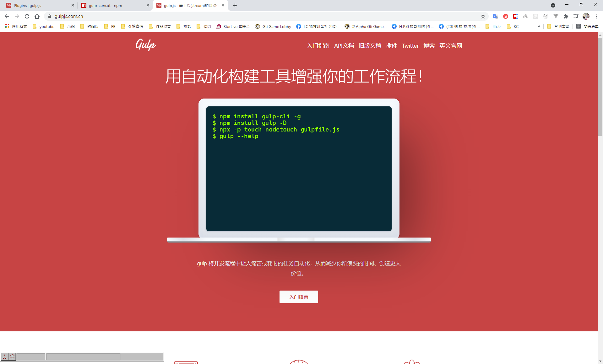

20210501114133

中文文檔參考網址
www.gulpjs.com.cn/docs/api

舊版文檔
https://v3.gulpjs.com.cn/docs/api/

## gulp.src(globs[, options])

來源目錄

```js
gulp.src('client/templates/*.jade')
  .pipe(jade())
  .pipe(minify())
  .pipe(gulp.dest('build/minified_templates'));
```

## gulp.dest(path[, options])

目的目錄

```js
gulp.src('client/templates/*.jade')
  .pipe(jade())
  .pipe(minify())
  .pipe(gulp.dest('build/minified_templates'));
```

# gulp.task(name[, deps], fn)

定義一個任務

```js
gulp.task('somename', function() {
    // do something
});
```

# gulp.watch(glob [, opts], tasks) 或 gulp.watch(glob [, opts, cb])

監視事件

```js
var watcher = gulp.watch('js/**/*.js', ['uglify','reload']);
watcher.on('change', function(event) {
  console.log('File ' + event.path + ' was ' + event.type + ', running tasks...');
});
```

# Gulp插件查詢

https://gulpjs.com/plugins/

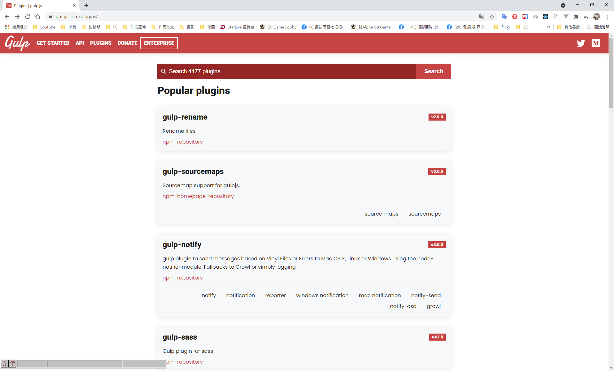

## npm也能查詢

https://www.npmjs.com/package/gulp-concat

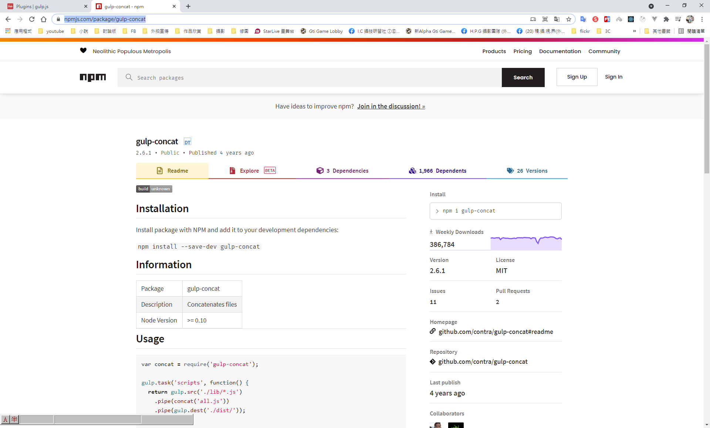


# 準備測試用的資料夾

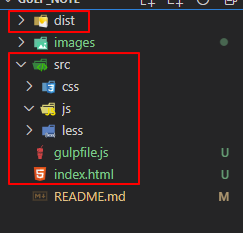

# 安裝gulp

專案初始化，產生package.json

```bash
npm init
```

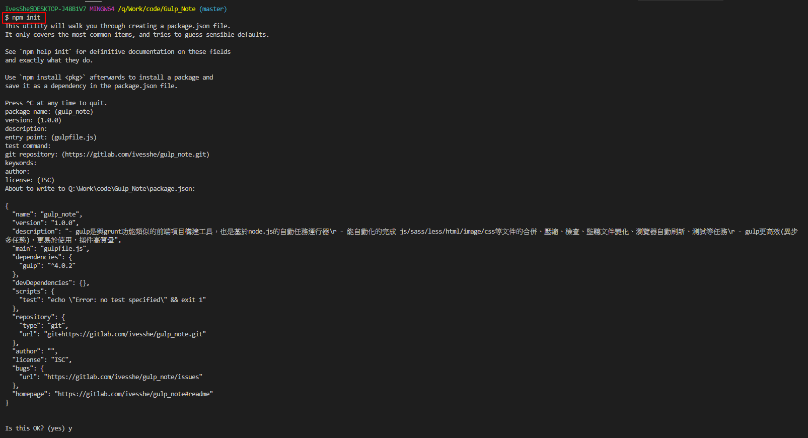

全局安裝

```bash
npm i gulp -g
```

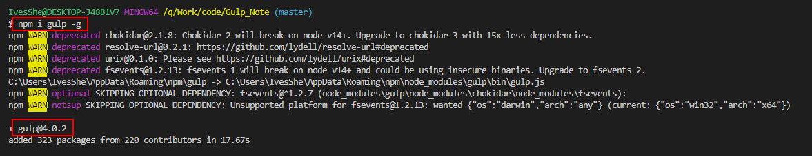

局部安裝

--save-dev 為開發依賴包

```bash
npm i gulp --save-dev
```

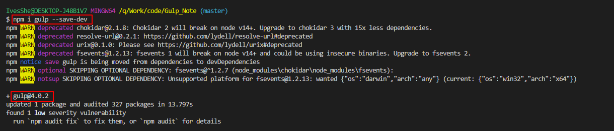

# gulp相關插件

- gulp-concat：合併文件(js/css)
- gulp-uglify：壓縮js文件
- gulp-rename：文件重命名
- gulp-less：編譯less
- gulp-clean-css：壓縮css
- gulp-liverload：實時自動編譯刷新

# 下載插件

```bash
npm i gulp-concat gulp-uglify gulp-rename --save-dev
```

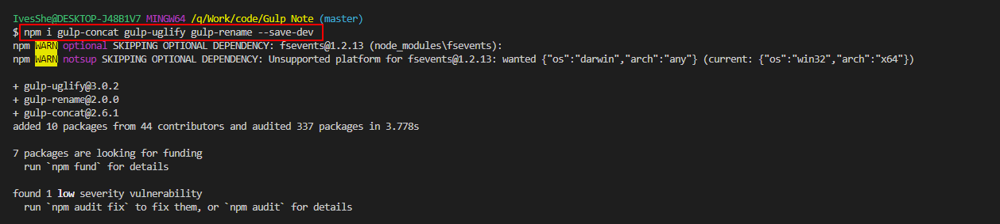

# 注冊合併壓縮js的任務

```js
// 注冊合併壓縮js的任務
gulp.task('js',function(){
    //gulp.src('src/js/**/*.js') 這樣寫可以連子目錄一起遍歷

    // 找到目標原文件，將數據讀取到gulp的內存中
    return gulp.src('src/js/*.js')
    .pipe(concat('build.js'))       // 臨時合併文件
    .pipe(gulp.dest('dist/js/'))    // 輸出文件到本地
    .pipe(uglify())                 // 壓縮文件
    .pipe(rename({suffix: '.min'})) // 重命名
    .pipe(gulp.dest('dist/js/')) 
})

```

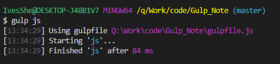

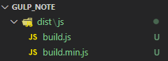

# css打包相關插件

```bash
npm i gulp-less gulp-clean-css --save-dev
```


# 注冊轉換less的任務

```js
// 注冊轉換less的任務
gulp.task('less',function(){
    return gulp.src('src/less/*.less')
    .pipe(less())
    .pipe(gulp.dest('src/css/'))
})
```

```js
gulp less
```

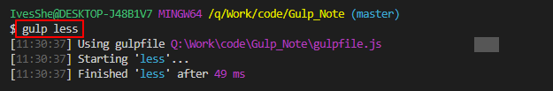

# 注冊轉換css的任務

```js
// 注冊合併壓縮css的文件
gulp.task('css',function(){
    return gulp.src('src/css/*.css')
    .pipe(concat('build.css'))
    .pipe(rename({suffix: '.min'}))
    .pipe(cleancss({compatibility:'ie8'}))
    .pipe(gulp.dest('dist/css/'))
})
```

```js
gulp css
```

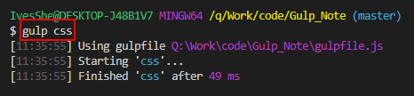

# 測試

index.html

```html
<!DOCTYPE html>
<html lang="en">
<head>
    <meta charset="UTF-8">
    <meta http-equiv="X-UA-Compatible" content="IE=edge">
    <meta name="viewport" content="width=device-width, initial-scale=1.0">
    <title>Document</title>
    <link rel="stylesheet" href="dist/css/build.min.css">
</head>
<body>
    <div id="div1" class="index1">1111</div>
    <div id="div2" class="index2">2222</div>
    <script type="text/javascript" src="dist/js/build.min.js"></script>
    <!-- <script type="text/javascript" src="src/js/test2.js"></script> -->
</body>
</html>
```

執行畫面

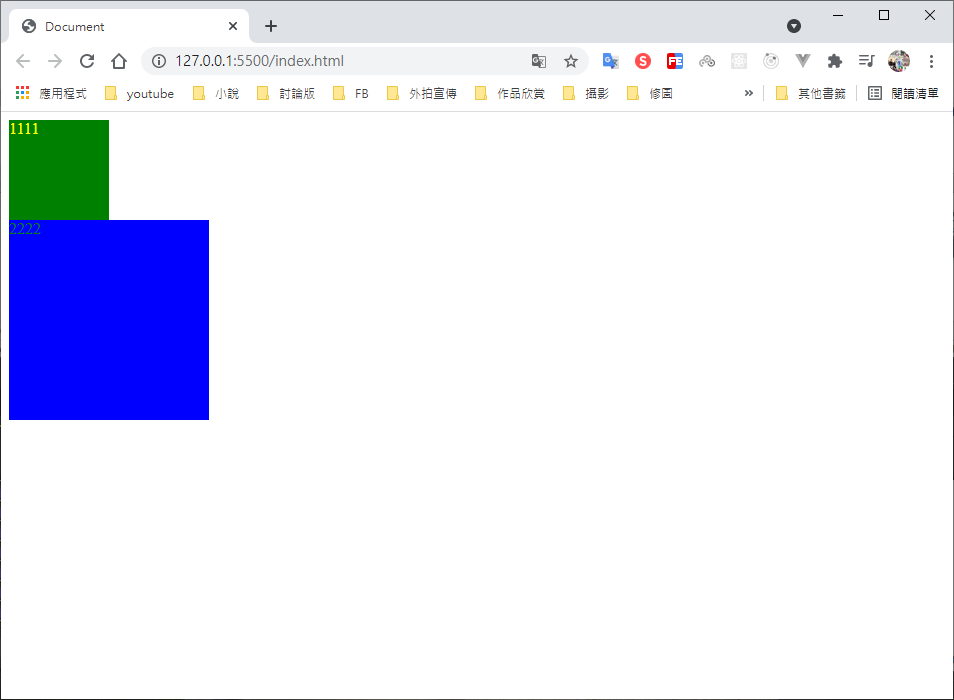


# 同、異步執行

## gulp 3.9.1版本

異步執行，加return

```js
gulp.task('css',function(){
    return gulp.src('src/css/*.css')
    .pipe(concat('build.css'))
    .pipe(rename({suffix: '.min'}))
    .pipe(cleancss({compatibility:'ie8'}))
    .pipe(gulp.dest('dist/css/'))
})
```

同步執行，不加return

```js
gulp.task('css',function(){
    gulp.src('src/css/*.css')
    .pipe(concat('build.css'))
    .pipe(rename({suffix: '.min'}))
    .pipe(cleancss({compatibility:'ie8'}))
    .pipe(gulp.dest('dist/css/'))
})
```

## gulp 4.0.2版本

### gulp.series：按照顺序执行

```js
gulp.task('default', gulp.series('js', 'less','css'));
```

### gulp.parallel：可以并行计算

```js
gulp.task('default', gulp.parallel('js', 'less','css'));
```

# Task工作依賴的寫法

gulp.task('css',['less'],function(){

## gulp 3.9.1版本

```js
gulp.task('css',['less'],function(){
```
## gulp 4.0.2版本

```js
gulp.task('css',gulp.series('less'),function(){   
```

若css有寫less依賴時，寫default時要省略less

```js
//gulp.task('default', gulp.parallel('js', 'less','css'));
//gulp.task('default', gulp.parallel('js', 'css')); // 若css有寫less依賴時，要省略less
```

# 處理html

下載插件

```bash
npm i gulp-htmlmin --save-dev
```

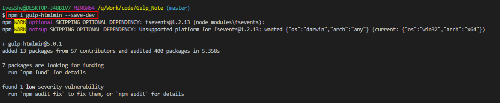

# 自動編譯(半自動)

下載插件

```bash
npm i gulp-livereload --save-dev
```

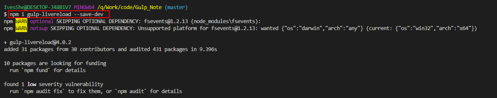

# 自動編譯(全自動) - 熱加載(實時加載)

下載插件

```bash
npm i gulp-connect --save-dev
```

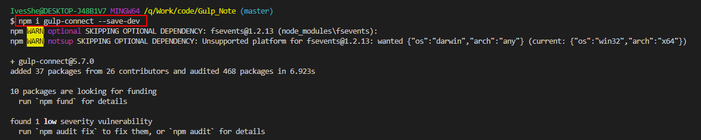

# 打包加載gulp插件

下載插件

```bash
npm i gulp-load-plugins --save-dev
```

# 壓縮圖片

下載插件

```bash
npm i gulp-imagemin --save-dev 
```

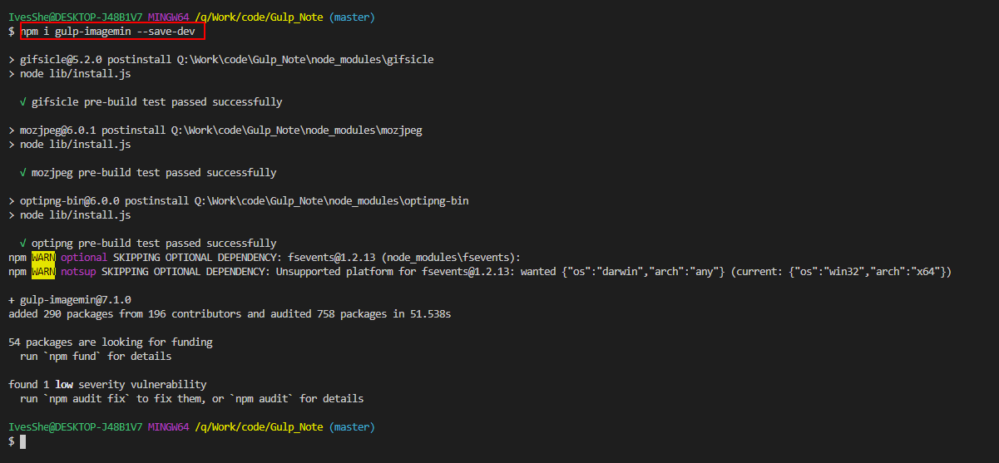

# gulp-file-inline

一个用于内联资源文件的 gulp 插件

下載插件

```bash
npm i gulp-file-inline --save-dev 
```

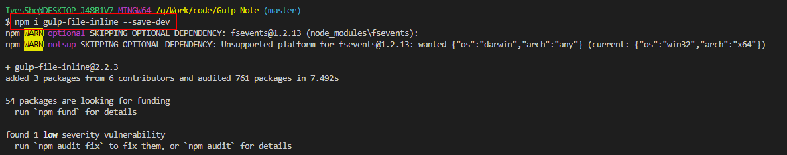

